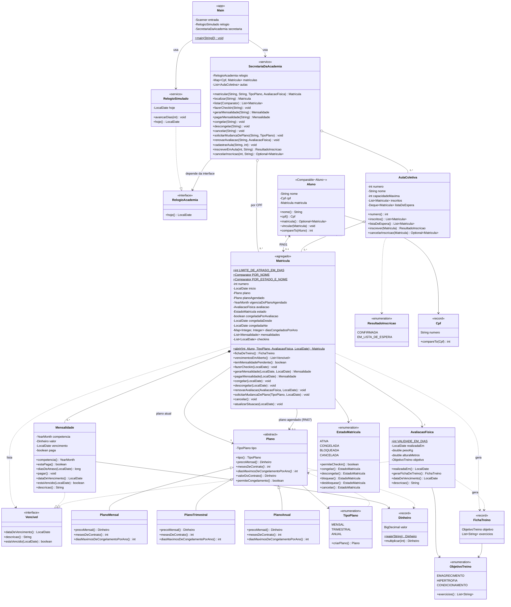
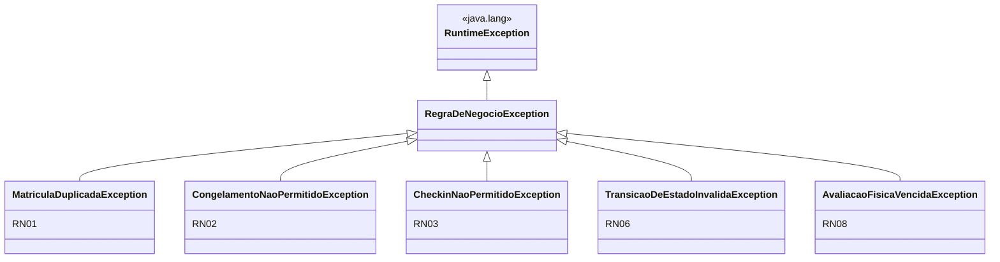

# Diagrama de Classes — Academia e Planos (D2 · HEALTHTECH)

```mermaid
classDiagram
    direction TB

    %% ===================== app / serviço =====================
    class Main {
        <<app>>
        -Scanner entrada
        -RelogioSimulado relogio
        -SecretariaDaAcademia secretaria
        +main(String[])$ void
    }

    class SecretariaDaAcademia {
        <<servico>>
        -RelogioAcademia relogio
        -Map~Cpf, Matricula~ matriculas
        -List~AulaColetiva~ aulas
        +matricular(String, String, TipoPlano, AvaliacaoFisica) Matricula
        +localizar(String) Matricula
        +listar(Comparator) List~Matricula~
        +fazerCheckin(String) void
        +gerarMensalidade(String) Mensalidade
        +pagarMensalidade(String) Mensalidade
        +congelar(String) void
        +descongelar(String) void
        +cancelar(String) void
        +solicitarMudancaDePlano(String, TipoPlano) void
        +renovarAvaliacao(String, AvaliacaoFisica) void
        +cadastrarAula(String, int) void
        +inscreverEmAula(int, String) ResultadoInscricao
        +cancelarInscricao(int, String) Optional~Matricula~
    }

    class RelogioAcademia {
        <<interface>>
        +hoje() LocalDate
    }

    class RelogioSimulado {
        <<servico>>
        -LocalDate hoje
        +avancarDias(int) void
        +hoje() LocalDate
    }

    %% ===================== modelo =====================
    class Aluno {
        <<Comparable~Aluno~>>
        -String nome
        -Cpf cpf
        -Matricula matricula
        +nome() String
        +cpf() Cpf
        +matricula() Optional~Matricula~
        ~vincular(Matricula) void
        +compareTo(Aluno) int
    }

    class Matricula {
        <<agregado>>
        +int LIMITE_DE_ATRASO_EM_DIAS$
        +Comparator POR_NOME$
        +Comparator POR_ESTADO_E_NOME$
        -int numero
        -LocalDate inicio
        -Plano plano
        -Plano planoAgendado
        -YearMonth vigenciaDoPlanoAgendado
        -AvaliacaoFisica avaliacao
        -EstadoMatricula estado
        -boolean congeladaPorAvaliacao
        -LocalDate congeladaDesde
        -LocalDate congeladaAte
        -Map~Integer, Integer~ diasCongeladosPorAno
        -List~Mensalidade~ mensalidades
        -List~LocalDate~ checkins
        +abrir(int, Aluno, TipoPlano, AvaliacaoFisica, LocalDate)$ Matricula
        +fichaDeTreino() FichaTreino
        +vencimentosEmAberto() List~Vencivel~
        +temMensalidadePendente() boolean
        +fazerCheckin(LocalDate) void
        +gerarMensalidade(LocalDate, LocalDate) Mensalidade
        +pagarMensalidade(LocalDate) Mensalidade
        +congelar(LocalDate) void
        +descongelar(LocalDate) void
        +renovarAvaliacao(AvaliacaoFisica, LocalDate) void
        +solicitarMudancaDePlano(TipoPlano, LocalDate) void
        +cancelar() void
        +atualizarSituacao(LocalDate) void
    }

    class Mensalidade {
        -YearMonth competencia
        -Dinheiro valor
        -LocalDate vencimento
        -boolean paga
        +competencia() YearMonth
        +estaPaga() boolean
        +diasDeAtraso(LocalDate) long
        +pagar() void
        +dataDeVencimento() LocalDate
        +estaVencido(LocalDate) boolean
        +descricao() String
    }

    class AvaliacaoFisica {
        +int VALIDADE_EM_DIAS$
        -LocalDate realizadaEm
        -double pesoKg
        -double alturaMetros
        -ObjetivoTreino objetivo
        +realizadaEm() LocalDate
        +gerarFichaDeTreino() FichaTreino
        +dataDeVencimento() LocalDate
        +descricao() String
    }

    class AulaColetiva {
        -int numero
        -String nome
        -int capacidadeMaxima
        -List~Matricula~ inscritos
        -Deque~Matricula~ listaDeEspera
        +numero() int
        +inscritos() List~Matricula~
        +listaDeEspera() List~Matricula~
        +inscrever(Matricula) ResultadoInscricao
        +cancelarInscricao(Matricula) Optional~Matricula~
    }

    class Vencivel {
        <<interface>>
        +dataDeVencimento() LocalDate
        +descricao() String
        +estaVencido(LocalDate) boolean
    }

    %% ===================== plano =====================
    class Plano {
        <<abstract>>
        -TipoPlano tipo
        +tipo() TipoPlano
        +precoMensal()* Dinheiro
        +mesesDeContrato()* int
        +diasMaximosDeCongelamentoPorAno()* int
        +valorDoContrato() Dinheiro
        +permiteCongelamento() boolean
    }
    class PlanoMensal {
        +precoMensal() Dinheiro
        +mesesDeContrato() int
        +diasMaximosDeCongelamentoPorAno() int
    }
    class PlanoTrimestral {
        +precoMensal() Dinheiro
        +mesesDeContrato() int
        +diasMaximosDeCongelamentoPorAno() int
    }
    class PlanoAnual {
        +precoMensal() Dinheiro
        +mesesDeContrato() int
        +diasMaximosDeCongelamentoPorAno() int
    }

    %% ===================== enums =====================
    class TipoPlano {
        <<enumeration>>
        MENSAL
        TRIMESTRAL
        ANUAL
        +criarPlano() Plano
    }
    class EstadoMatricula {
        <<enumeration>>
        ATIVA
        CONGELADA
        BLOQUEADA
        CANCELADA
        +permiteCheckin() boolean
        +congelar() EstadoMatricula
        +descongelar() EstadoMatricula
        +bloquear() EstadoMatricula
        +desbloquear() EstadoMatricula
        +cancelar() EstadoMatricula
    }
    class ObjetivoTreino {
        <<enumeration>>
        EMAGRECIMENTO
        HIPERTROFIA
        CONDICIONAMENTO
        +exercicios() List~String~
    }
    class ResultadoInscricao {
        <<enumeration>>
        CONFIRMADA
        EM_LISTA_DE_ESPERA
    }

    %% ===================== valor (records) =====================
    class Cpf {
        <<record>>
        String numero
        +compareTo(Cpf) int
    }
    class Dinheiro {
        <<record>>
        BigDecimal valor
        +reais(String)$ Dinheiro
        +multiplicar(int) Dinheiro
    }
    class FichaTreino {
        <<record>>
        ObjetivoTreino objetivo
        List~String~ exercicios
    }

    %% ===================== relacionamentos =====================
    Main --> SecretariaDaAcademia : usa
    Main --> RelogioSimulado : usa
    RelogioSimulado ..|> RelogioAcademia
    SecretariaDaAcademia --> RelogioAcademia : depende da interface
    SecretariaDaAcademia o-- "0..*" Matricula : por CPF
    SecretariaDaAcademia o-- "0..*" AulaColetiva

    Aluno "1" <--> "0..1" Matricula : RN01
    Aluno --> Cpf
    Matricula *-- "0..*" Mensalidade
    Matricula --> "1" Plano : plano atual
    Matricula --> "0..1" Plano : plano agendado (RN07)
    Matricula --> "1" AvaliacaoFisica
    Matricula --> "1" EstadoMatricula
    Matricula ..> FichaTreino : gera
    Matricula ..> Vencivel : lista

    Mensalidade ..|> Vencivel
    AvaliacaoFisica ..|> Vencivel
    Mensalidade --> Dinheiro
    AvaliacaoFisica --> ObjetivoTreino
    AvaliacaoFisica ..> FichaTreino : gera
    FichaTreino --> ObjetivoTreino

    AulaColetiva o-- "0..*" Matricula : inscritos / espera
    AulaColetiva ..> ResultadoInscricao

    Plano <|-- PlanoMensal
    Plano <|-- PlanoTrimestral
    Plano <|-- PlanoAnual
    Plano --> TipoPlano
    Plano ..> Dinheiro
    TipoPlano ..> Plano : fábrica
```

## 2. Hierarquia de exceções (R10)

```mermaid
classDiagram
    direction TB
    class RuntimeException {
        <<java.lang>>
    }
    class RegraDeNegocioException
    class MatriculaDuplicadaException {
        RN01
    }
    class CongelamentoNaoPermitidoException {
        RN02
    }
    class CheckinNaoPermitidoException {
        RN03
    }
    class TransicaoDeEstadoInvalidaException {
        RN06
    }
    class AvaliacaoFisicaVencidaException {
        RN08
    }

    RuntimeException <|-- RegraDeNegocioException
    RegraDeNegocioException <|-- MatriculaDuplicadaException
    RegraDeNegocioException <|-- CongelamentoNaoPermitidoException
    RegraDeNegocioException <|-- CheckinNaoPermitidoException
    RegraDeNegocioException <|-- TransicaoDeEstadoInvalidaException
    RegraDeNegocioException <|-- AvaliacaoFisicaVencidaException
```
